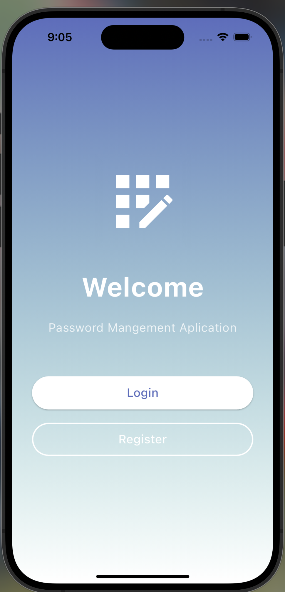
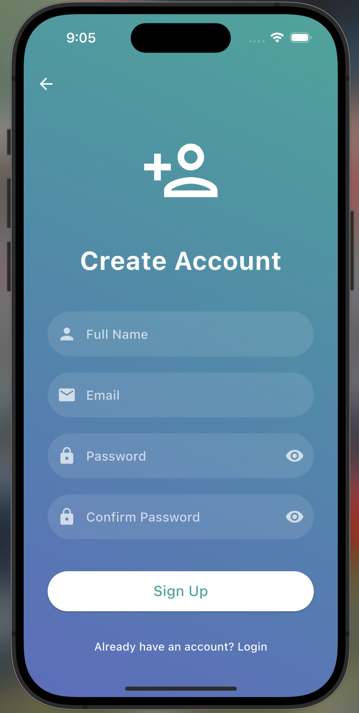
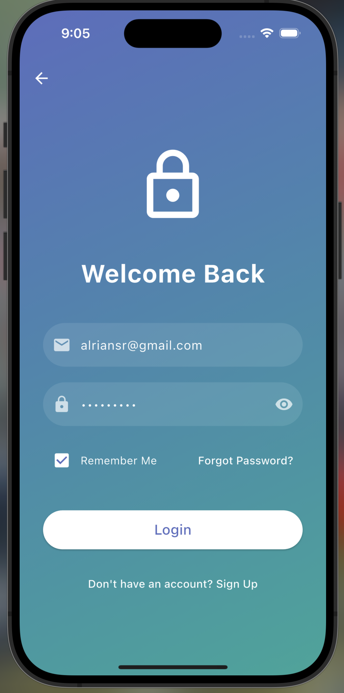
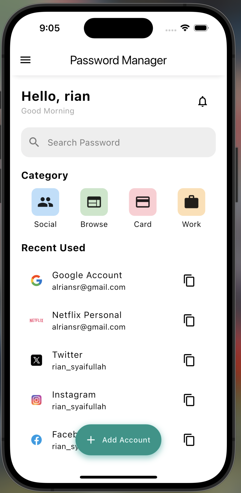
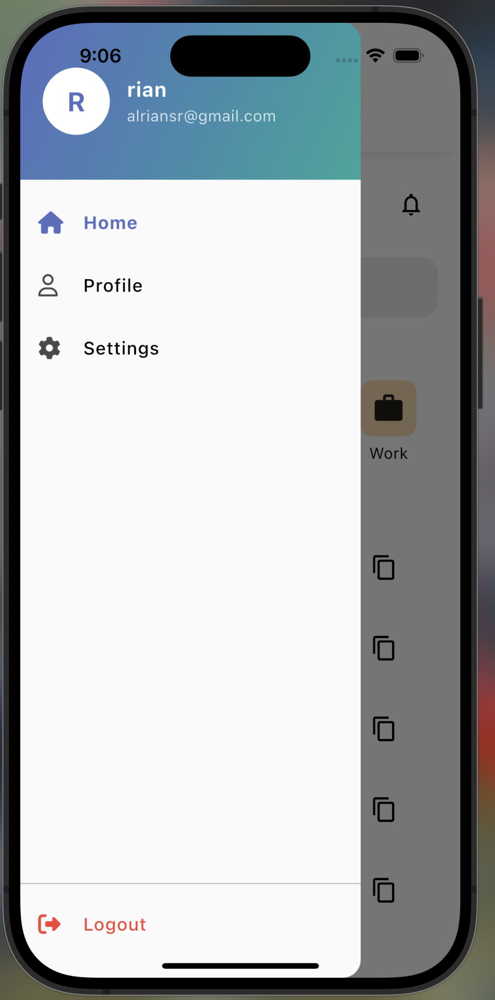
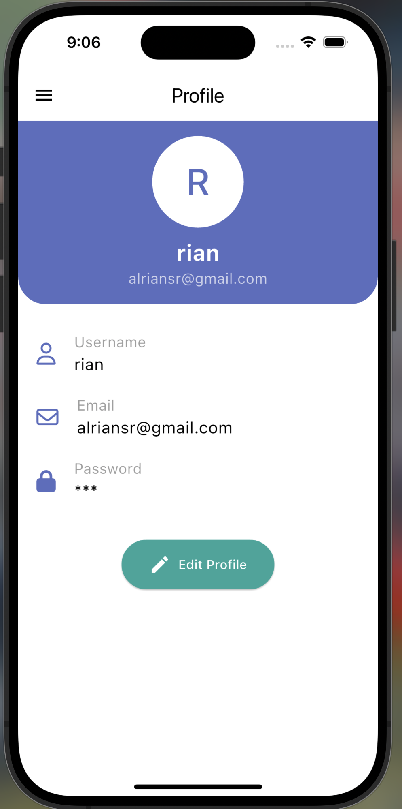
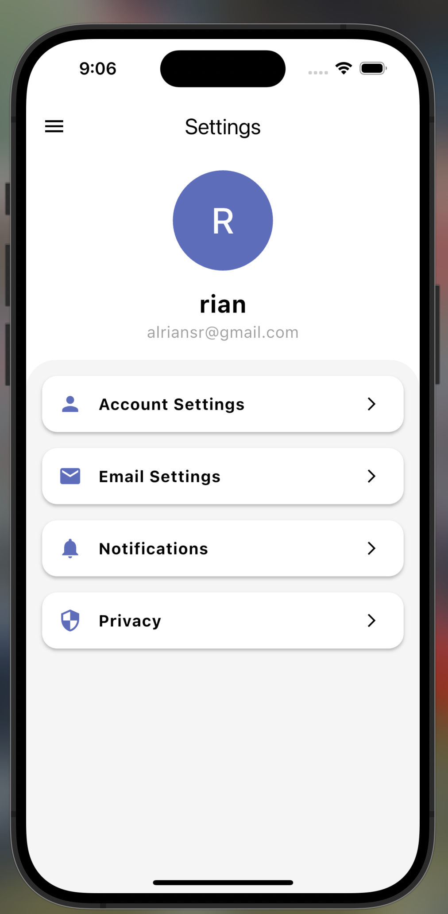

# Tugas Pertemuan 3

Nama: **Ahmad Rian Syaifullah Ritonga**  
NIM: **H1D022010**  
Shift Baru: **D**

## Getting Started Password Management Application

## Highlight Code

### 1. Using Color Palette

```dart
colorScheme: ColorScheme.light(
  background: Colors.grey.shade50,
  onBackground: Colors.black,
  primary: const Color(0xFF5C6BC0),
  secondary: const Color(0xFF26A69A),
  tertiary: const Color(0xFFFFB74D),
  outline: Colors.grey.shade400,
),
```

### 2. Manage Routes

```dart
routes: {
  '/welcome': (context) => Welcome(),
  '/login': (context) => LoginPage(),
  '/register': (context) => RegisterPage(),
  '/home': (context) => HomeScreen(),
  '/profile': (context) => ProfileScreen(),
  '/settings': (context) => SettingsScreen(),
},
```

### 3. Make Sidebar and How to Use

Sidebar Items:

```dart
children: [
  SidebarItem(
    icon: FontAwesomeIcons.house,
    title: 'Home',
    onTap: () => widget.onItemTap('/home'),
    isSelected: widget.currentRoute == '/home',
  ),
  SidebarItem(
    icon: FontAwesomeIcons.user,
    title: 'Profile',
    onTap: () => widget.onItemTap('/profile'),
    isSelected: widget.currentRoute == '/profile',
  ),
  SidebarItem(
    icon: FontAwesomeIcons.gear,
    title: 'Settings',
    onTap: () => widget.onItemTap('/settings'),
    isSelected: widget.currentRoute == '/settings',
  ),
],
```

Implementing Sidebar:

```dart
drawer: Sidebar(
  onItemTap: (routeName) {
    Navigator.of(context).pop();
    if (routeName != '/home') {
      Navigator.of(context).pushReplacementNamed(routeName);
    }
  },
  currentRoute: '/home',
),
```

### 4. Use FloatingActionButton

```dart
child: FloatingActionButton.extended(
  onPressed: () {
    Navigator.of(context).push(MaterialPageRoute(
      builder: (context) => AddPasswordScreen(),
    ));
  },
  icon: Icon(Icons.add, color: Colors.white),
  label: Text('Add Account', style: TextStyle(color: Colors.white)),
  backgroundColor: Colors.teal,
  elevation: 0,
  shape: RoundedRectangleBorder(
    borderRadius: BorderRadius.circular(30),
  ),
),
```

## Screenshots

<div style="display: flex; flex-wrap: wrap; gap: 10px; justify-content: space-between;">
  
  
  
  
  
  
  
  
</div>
